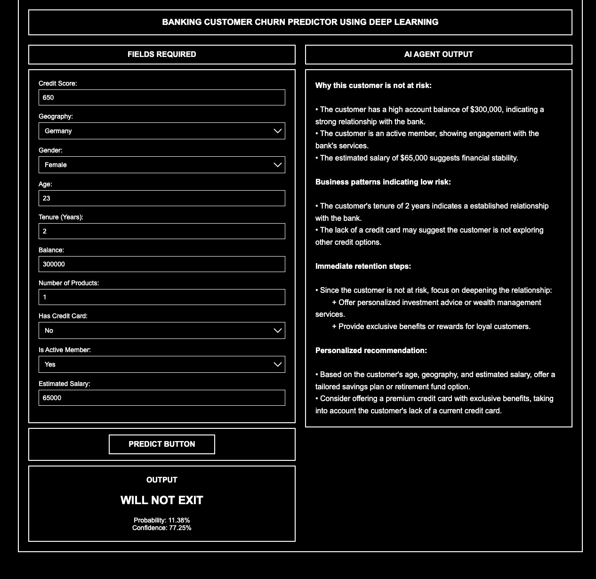

# Customer_churn-_prediction
It is a Neural Network based solution using ANN to predict.

# **Customer Churn Prediction using ANN**

## **Data Preprocessing**

* **Label Encoding** for binary categorical features (e.g., Gender → 0/1).
* **One-Hot Encoding** for multi-class features (e.g., Geography → France/Germany/Spain).
* **StandardScaler** applied so all numerical features have **mean = 0** and **standard deviation = 1**.
  This makes features comparable and helps **Gradient Descent converge faster**.

---

## **Artificial Neural Network (ANN)**

A simple feed-forward neural network is used because the data is **tabular**, not a complex sequence (so Transformer is unnecessary).

### **Input Features (11)**

CreditScore, Geography, Gender, Age, Tenure, Balance, NumOfProducts,
HasCrCard, IsActiveMember, EstimatedSalary

### **Architecture**

* **3 Hidden Layers**, each with **6 neurons**, **ReLU activation**
* **Dropout (0.1)** added after each hidden layer to reduce overfitting
* **Output Layer:** 1 neuron, **Sigmoid activation** (outputs probability of churn)

### **Optimizer: Adam**

Chosen because it:

* Adapts learning rate automatically
* Converges fast
* Works well on noisy real-world tabular data
* Avoids poor local minima

---

## **Evaluation**

* The model is trained and validated **10 times** on different data splits.
* Each fold trains the ANN for **100 epochs** using only the **85% training data**.
* This provides a more stable and reliable accuracy than a single train/test split.

  

  <em>
    This is the frontend view displaying the inference system and the deployed AI agent, 
    which provides recommendations to the bank for improving customer experience based 
    on the given customer's profile.
  </em>

LLaMA-70B Instruct:Used to build AI agent for reccomendation to the bank to improve customer experience.

Performed instruction tuning by making API calls to the LLaMA-Instruct-70B model.

Provided curated prompts and examples to guide the model toward producing high-quality, task-aligned outputs.

This tuning process helped the AI agent generate meaningful recommendations for improving customer experience based on customer profiles.

